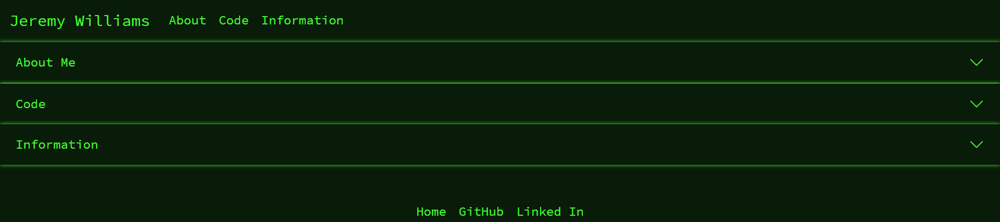

# Portfolio 2

[See the site yourself by clicking here!](https://wijeremy.github.io/portfolio.2/)

## Description

I built this site to practice applying css to bootstrap. I also had quite a bit of fun finding the simplest way to hardcode a database into my app. It only reads with the fetch function and doesn't require any libraries. But it means that I was able to deploy the cards of my coding examples modularly, using the same html (which I also hard coded into the js file) for each one and replacing important values with variables.
I also needed an updated portfolio. My old one was decent but I like the simple sharp design bootsrap had to offer.

## Table of Contents

- [Installation](#installation)
- [Usage](#usage)
- [License](#license)
- [Contributing](#contributing)
- [Tests](#tests)
- [Questions](#questions)

## Installation

No need to install anything, though if you want to use it yourself, I would replace the about me and the information in the db.json.

## Usage

This was a personal portfolio, but if you wanted to use the design for yourself, I would just mess with the CSS and update the personal information.

## License

I am using [MIT](https://opensource.org/licenses/MIT) to license this app.

## Contributing

See licensing.

## Tests

No tests provided.

## Questions?

Email me at jeremydavwilliams@gmail.com or visit [my github page](github.com/wijeremy)
